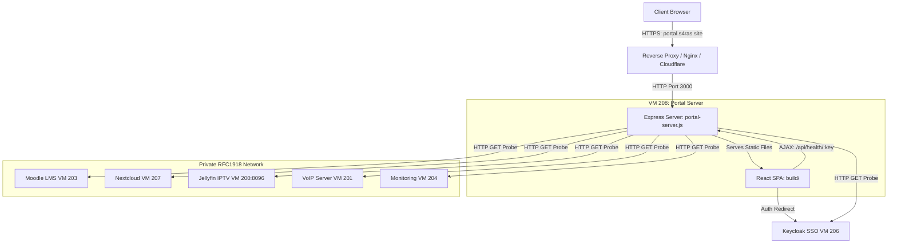
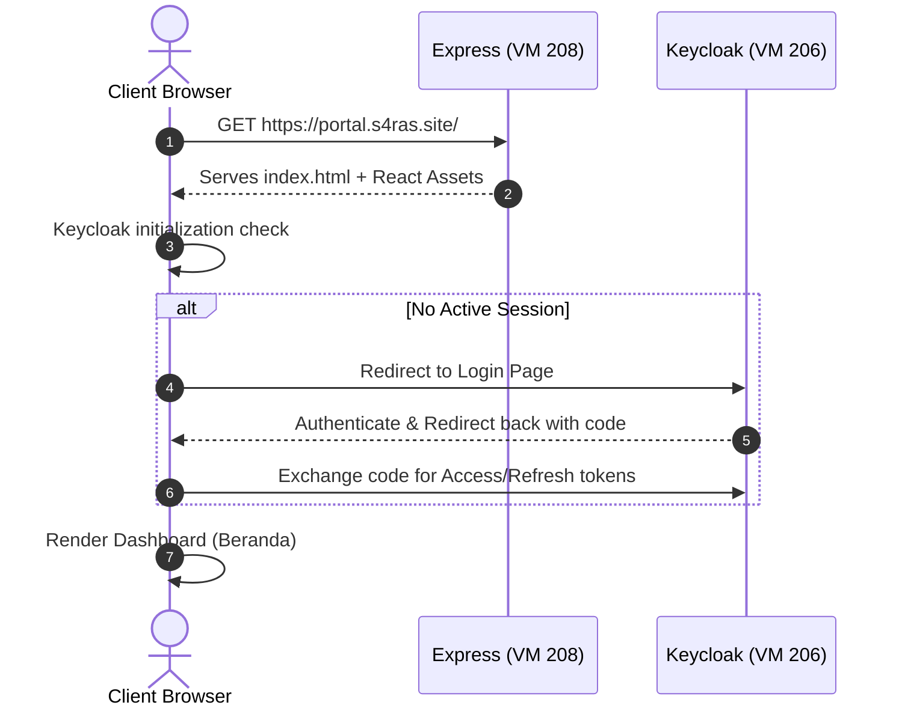
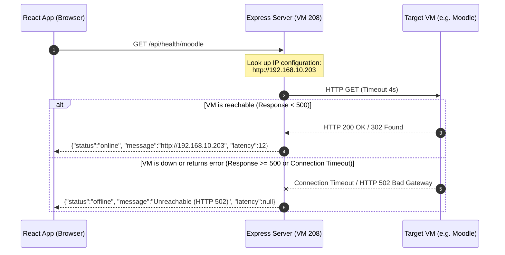

# Portal S4RAS: Architecture, System Design, and Structural View

This document provides a holistic overview of the Portal S4RAS repository, detailing its system design, architectural patterns, directory structure, and execution flows.

---

## 1. High-Level System Architecture

Portal S4RAS serves as the central landing page and dashboard for the **S4RAS** self-hosted ecosystem. It acts as both the entry point for users and a real-time monitor for the overall health of associated services.



---

## 2. Key Architectural Design Patterns

### A. Combined Static Server & Health-Check Proxy
To bypass CORS (Cross-Origin Resource Sharing) restrictions and browser security limitations (such as `no-cors` fetches resolving false-positives on 502/503 proxy pages), the application uses a **BFF (Backend-for-Frontend)** architecture implemented within `scripts/portal-server.js`:
*   **Static Serving**: It serves the React bundle (`build/`) to client web browsers.
*   **Server-Side Health Probing**: When a client requests a health status check via `/api/health/:key`, the server makes a direct HTTP probe to the internal IP address (LAN) of that service.
*   **Result Reporting**: The server determines if the target is up (HTTP status < 500) and sends clean JSON (`{ status: "online"/"offline", latency }`) back to the browser.

### B. SSO Integration (Keycloak)
*   User identity and session verification are handled centrally via Keycloak.
*   The frontend uses the `keycloak-js` adapter to enforce session states and authenticate actions.

### C. Automated Deployment & Webhook Trigger
The deployment process operates as follows:
1.  **Code Commit**: Developer pushes code to GitHub.
2.  **Continuous Integration**: GitHub Actions runs tests and packages the static frontend bundle.
3.  **Self-Hosted Runner / Trigger**: A deployment workflow uses SSH/SCP or a custom PM2 deployment script (`scripts/deploy-server.js` running on port 4000) to pull, install, rebuild, and reload the production process.

---

## 3. Repository Structural View

Here is a map of the repository's directories and critical files:

```
Portal-SARAS/
├── .github/workflows/          # CI/CD Workflows for automated building/testing
├── build/                      # Production-ready compiled assets (HTML, JS, CSS)
├── public/                     # Static assets (favicons, logos, manifests)
├── scripts/
│   ├── deploy-server.js        # Background webhook daemon to trigger pulls/rebuilds
│   └── portal-server.js        # Production Express server (Static host + Health API)
├── src/
│   ├── components/             # Reusable UI components
│   │   ├── Layout.jsx          # Shell structure containing header, footer, and sidebar
│   │   ├── StatusBadge.jsx     # Visual indicator for online/offline states
│   │   └── SkeletonCard.jsx    # Loading placeholder visual state
│   ├── config/
│   │   └── services.js         # Master registry of all services (URLs, internal IPs, icons)
│   ├── context/
│   │   ├── KeycloakContext.jsx # Global SSO auth context state
│   │   └── ThemeLanguageContext.jsx # Theme (dark/light) & language preference context
│   ├── pages/
│   │   ├── Beranda.jsx         # Dashboard Homepage showing service grids & status map
│   │   └── Admin.jsx           # Protected route containing system management details
│   ├── services/
│   │   └── backend.js          # API abstraction layers (fetchAnnouncements, checkServiceHealth)
│   ├── App.jsx                 # Main entry React Router tree mapping layout pages
│   ├── index.css               # Global Tailwind/CSS rules
│   └── index.jsx               # React DOM bootstrapping root
├── DEPLOY.md                   # Instructions for registering self-hosted runners
├── ecosystem.config.js         # PM2 configurations (portal-prod & deploy-trigger processes)
├── package.json                # Project dependencies (React 19, Express 5, Vite, Tailwind v4)
└── vite.config.mjs             # Vite compiler rules, environment plugins, and test setup
```

---

## 4. Key Execution Flows

### 1. Initial Page Load & Authentication Flow


### 2. Service Health Check Flow


---

## 5. VM 208 Process Configuration (PM2)

The server runs two persistent processes managed by **PM2** via `ecosystem.config.js`:

1.  **`portal-prod`**:
    *   **Script**: `scripts/portal-server.js`
    *   **Port**: `3000` (Reverse proxied by Nginx/Cloudflare)
    *   **Purpose**: Serves the React web app and runs the backend health-check logic.
2.  **`deploy-trigger`**:
    *   **Script**: `scripts/deploy-server.js`
    *   **Port**: `4000`
    *   **Purpose**: Listens for git deployment hooks or manual deploy triggers to rebuild the portal without stopping active user operations.
