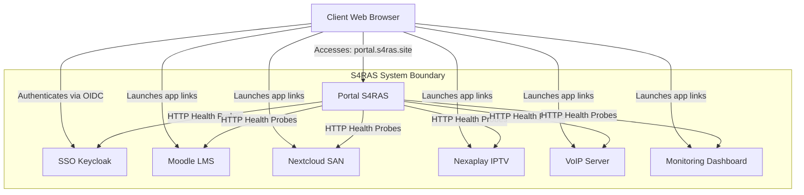
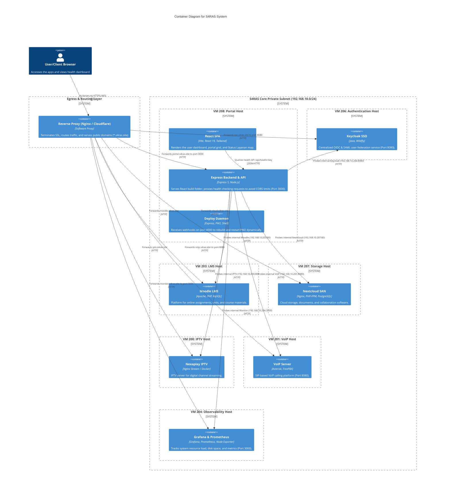

# System Architecture Document (SAD) — S4RAS Ecosystem

This document serves as the master technical blueprint and deployment documentation for the **S4RAS (Self-Hosted Service Gateway)** ecosystem.

---

## 1. System Overview & Objectives
S4RAS integrates multiple educational, communication, and management tools into a unified network. It provides:
1. **Single Entry Point**: A sleek React-based dashboard (`portal.s4ras.site`) running on **VM 208**.
2. **Centralized Authentication (SSO)**: Keycloak OIDC federation on **VM 206** protecting access across all services.
3. **Status Monitoring**: Server-side connection checking that reports real-time availability of private resources without CORS restrictions.

---

## 2. Ingress & Egress Traffic Architecture
The architecture operates under a strict **private-first** design. Virtual machines live on a private Class C subnet (`192.168.10.0/24`) and egress traffic through a centralized gateway/reverse proxy.

```
       [ Client Web Browser ]
                 │
                 ▼ (Public Internet)
      HTTPS (443) / SSL Termination
                 │
      [ Reverse Proxy / Nginx ]
                 │
        ┌────────┼────────┬────────┬────────┬────────┐ (Internal Network - 192.168.10.x)
        │        │        │        │        │        │
      Port     Port     Port     Port     Port     Port
      3000     8080      80       80      8080     3000
        │        │        │        │        │        │
      [VM208]  [VM206]  [VM203]  [VM207]  [VM201]  [VM204]
      Portal   Keycloak Moodle  Nextcloud  VoIP   Monitor
```

### Ingress Port Mapping
*   **Public Gateway (Nginx/Cloudflare)**: Terminates SSL and forwards traffic based on server names:
    *   `portal.s4ras.site` ──> `http://192.168.10.208:3000`
    *   `sso.s4ras.site` ──> `http://192.168.10.206:8080`
    *   `moodle.s4ras.site` ──> `http://192.168.10.203:80`
    *   `cloud.s4ras.site` ──> `http://192.168.10.207:80`
    *   `iptv.s4ras.site` ──> `http://192.168.10.200:80`
    *   `voip.s4ras.site` ──> `http://192.168.10.201:8080`
    *   `monitor.s4ras.site` ──> `http://192.168.10.204:3000`

---

## 3. C4 Architecture Diagrams

### Level 1: System Context Diagram
Shows high-level system boundaries and user interaction.



### Level 2: Container Diagram
Details virtual machine environments, technology stacks, and communications.



### Level 3: Component Diagram (VM 208 Internal Modules)
Focuses on internal processes inside VM 208.

```mermaid
graph TB
    subgraph Client_Browser ["Client Web Browser"]
        ReactApp[React App Bootstrapper]
        KC_JS[keycloak-js Adapter]
        BerandaPage[Beranda.jsx Dashboard]
        BackendService[services/backend.js]
    end

    subgraph Express_Container ["VM 208: Express Server Processes"]
        StaticServer[Static File Middleware]
        HealthController[Health Check Route /api/health/:key]
        ProbeHelper[HTTP/HTTPS probe() Helper]
        Registry[SERVICES Config Map]
    end

    subgraph External_VMs ["LAN VMs"]
        KeycloakHost[VM 206: Keycloak]
        MoodleHost[VM 203: Moodle]
        OtherVMs[Other Service Hosts]
    end

    ReactApp -->|1. Initializes Auth| KC_JS
    KC_JS -->|Redirect/Exchange Tokens| KeycloakHost
    BerandaPage -->|2. Triggers Health Scan| BackendService
    BackendService -->|3. AJAX GET /api/health/:key| HealthController
    
    StaticServer -->|Serves CSS/JS/HTML| ReactApp
    HealthController -->|4. Checks Key Registry| Registry
    HealthController -->|5. Calls probe() with internal URL| ProbeHelper
    ProbeHelper -->|6. TCP Get (Timeout 3s)| MoodleHost
    ProbeHelper -->|6. Fallback Public TCP Get (5s)| OtherVMs
```

### Level 4: Code Sequence Diagram (Probing Logic Flow)
Illustrates how the backend checks each endpoint.

```mermaid
sequenceDiagram
    autonumber
    actor Browser as User Browser
    participant Express as scripts/portal-server.js
    participant Registry as SERVICES Registry
    participant LAN as Target VM (Internal IP)
    participant Public as Target VM (Public URL)

    Browser->>Express: GET /api/health/moodle
    Express->>Registry: Lookup 'moodle' configurations
    Registry-->>Express: { internal: 'http://192.168.10.203', public: 'https://moodle.s4ras.site' }
    
    rect rgb(30, 40, 50)
        Note over Express, LAN: Try Internal Endpoint (LAN)
        Express->>LAN: HTTP GET http://192.168.10.203 (Timeout 3s)
        alt Responds < HTTP 500
            LAN-->>Express: HTTP 200 OK (5ms)
            Express-->>Browser: {"status":"online", "message":"http://192.168.10.203", "latency":6}
        else Fails / Timeout / HTTP >= 500
            LAN--xExpress: Timeout / HTTP 502 (3s)
        end
    end

    rect rgb(40, 30, 30)
        Note over Express, Public: Fallback to Public URL
        Express->>Public: HTTP GET https://moodle.s4ras.site (Timeout 5s)
        alt Responds < HTTP 500
            Public-->>Express: HTTP 302 Found (40ms)
            Express-->>Browser: {"status":"online", "message":"https://moodle.s4ras.site", "latency":42}
        else Fails / Timeout / HTTP >= 500
            Public--xExpress: Connection Error
            Express-->>Browser: {"status":"offline", "message":"Unreachable (HTTP 502)", "latency":null}
        end
    end
```



---

## 4. Deployment & Operations Playbook (Runbook)

### PM2 Process Administration
VM 208 manages execution of services using PM2:
*   **Start/Reload Portal processes**:
    ```bash
    pm2 startOrReload ecosystem.config.js
    ```
*   **Revive on boot up**:
    ```bash
    pm2 startup
    # Run generated systemd command
    pm2 save
    ```

### Rebuilding after Node Update
Whenever Node.js is updated on VM 208:
```bash
# 1. Update PM2 binary binding
npm install -g pm2
pm2 update

# 2. Reinstall packages
npm ci

# 3. Rebuild and trigger processes
npm run build
pm2 start ecosystem.config.js
pm2 save
```
